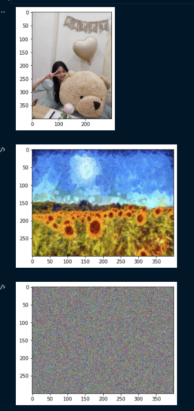

# Neural-style-transfer-pytorch

## Overview

### 1. Build model to extract features

- Using pretrained VGG19 model
- Using only layer index 0, 5, 10, 19, 28

### 2. Load images

- Load content image
- Load style image
- Generate random white noise target image

=> Resize style and target image to size of content image

### 3. Init hyperparameters and optimizer:

- style_weight: 1000,
- content_weight: 1,
- learning_rate: 0.001
- epochs: 6000

Using Adam optimizer with parameters is target_images

### 4. Training:

- Calculate content loss

$$content\_loss = \frac{1}{2}(content\_img - target\_img)^2$$

- Calculate style loss:

Gram matrix:

$$G = \frac{1}{c*h*w}(target\_img.target\_img^T)$$
$\newline$
$$A = \frac{1}{c*h*w}(style\_img.style\_img^T)$$

$$style\_loss = \frac{1}{2*c*h*w}.(G - A)^2$$
